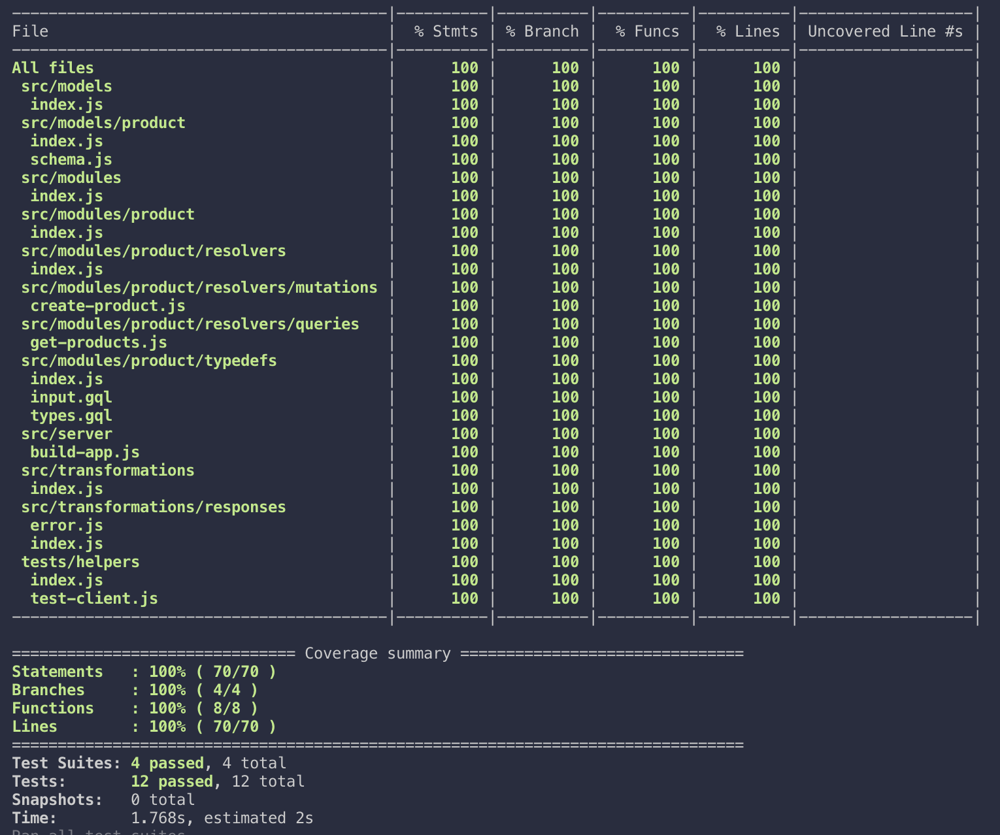
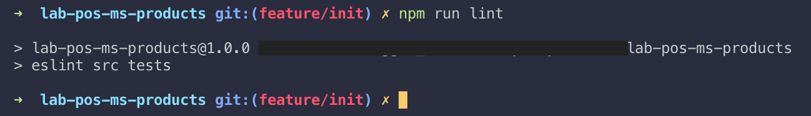

# lab-pos-ms-products
Microservice `products` for a point of sales that was created for my playground and learning purpose.

## Uses
* GraphQL
	* Apollo Server Express
	* Apollo Federation
* MongoDB
	* Mongoose

## Directory Structure
```
.
├── docs
│   └── images
│       ├── test-coverage.png
│       └── test-lint.png
├── src
│   ├── index.js
│   ├── models
│   │   ├── index.js
│   │   └── product
│   │       ├── index.js
│   │       └── schema.js
│   ├── modules
│   │   ├── index.js
│   │   └── product
│   │       ├── index.js
│   │       ├── resolvers
│   │       │   ├── index.js
│   │       │   ├── mutations
│   │       │   │   └── create-product.js
│   │       │   └── queries
│   │       │       └── get-products.js
│   │       └── typedefs
│   │           ├── index.js
│   │           ├── input.gql
│   │           └── types.gql
│   ├── server
│   │   ├── build-app.js
│   │   ├── connect-db.js
│   │   └── index.js
│   └── transformations
│       ├── index.js
│       └── responses
│           ├── error.js
│           └── index.js
├── tests
│   ├── fixtures
│   │   └── models
│   │       └── products
│   │           ├── product-list.json
│   │           └── validation-messages.json
│   ├── helpers
│   │   ├── index.js
│   │   └── test-client.js
│   ├── integration
│   │   └── graphql
│   │       └── product
│   │           ├── mutation
│   │           │   └── create-product.test.js
│   │           └── query
│   │               └── get-products.test.js
│   └── unit
│       ├── models
│       │   └── product.test.js
│       └── transformations
│           └── responses
│               └── error.test.js
├── .env.example
├── .gitignore
├── jest.config.js
├── package-lock.json
├── package.json
└── README.md
```

## Pre Commit
Coverage test, code lint and commit lint will be run before commit creation.

## Coverage Test


## Lint Test
